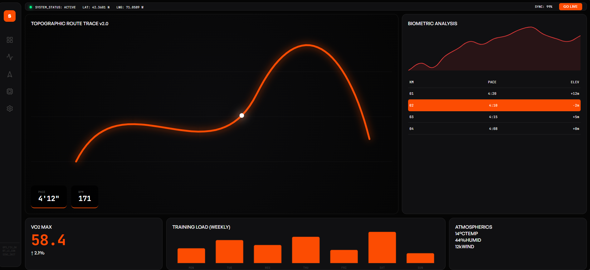

# Strava Desktop UI

This is a recreated design of my favorite app, **Strava**. I use it every single day to track my miles and keep my motivation high.

## Screenshot



## Tech Stack used:

* **HTML5** - Semantic structure and content.
* **CSS3** - Custom styling, Flexbox/Grid layout, and responsive design.
* **JavaScript (ES6)** - Dynamic interactivity and UI behaviors.

## Project Structure

```
strava-desktop-ui/
├── assets/
│   └── dashboard.png
├── index.html
├── styles.css
├── script.js
└── README.md
```

## How to Run this code

Clone this repository:

```bash
git clone https://github.com/aazainjan/strava-desktop-ui.git
```

Navigate to the project folder:

```bash
cd strava-desktop-ui
```

Launching the app: Open `index.html` in your favorite web browser.

## Notes

This project is front-end only. I built it specifically for design and UI practice.


